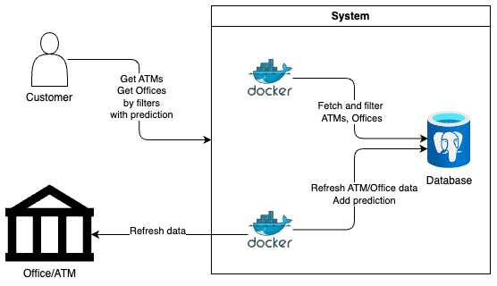

### Инфо
Исходный код: https://github.com/TeaDove/evraz-hack-misis-anime <br>
Демо видео: https://drive.google.com/file/d/1P48-pA65rloAXaj0YoXIH8gnvUF-sTm6/view?usp=share_link <br>
Интерфейс: http://158.160.13.117 <br>
Презентация: https://docs.google.com/presentation/d/1QAJ6SP_N2Q5dC_xDfNEl-xDTfyyHn_b7LaKz0dl4J_o/edit?usp=sharing <br>

### Команда
МИСИС анимешники!
Состав:
- Петер Ибрагимов, капитан команды, бекенд-девопс разработчик
- Артём Соседка, дата аналитик
- Евгений Четвертков, фронтенд разработчик
- Илья Киселевский, бекенд-девопс разработчик
- Яна Рыхлицкая, UI-UX дизайнер.

### Что надо
Разработать веб-приложение, с помощью которого машинист эксгаустера сможет мониторить состояние эксгаустеров и прогнозировать их возможную поломку.

Основа работы сервиса - поток реальных данных с датчиков агрегата через Kafka.

### Решение


Решение представляет собой сервис, состоящий из 5и частей:
- `MongoDB` - _No-SQL_ база данных для сохранения состояний экстраудеров и всех ивентов для последующей индексации по ним
- `RESTApi` - _FastAPI-based_ рест апи, для вывода данных на фронтенд
- `Kafka Processor` - процессинг ивентов из кафки
- `Analizer` - сервис анализа состояний экстраудеров для предсказаний
- `Frontend` - _React-based_ веб-сайт, для визуализации работы экстраудеров и предсказаний по ним

### Алгоритм работы предсказаний
Алгоритм работы предсказаний:<br>

0) Предполагается, что замены происходят в среднем один-два раза в месяц, в рабочие дни.
1) Возьмём историческую информацию о работе эксгаустера за период от последней замены ротора до текущего момента с дискретизацией в 15 минут.
2) Возьмём первое приближение даты замены - это разница между максимальным сроком годности ротора (это гиперпараметр, считаем как 20) и датой последнего ремонта.
3) Считаем критические ситуации (это ситуации, когда значения выходят за пределы референсных, таких как alarm_max и warning_max, разделим все эти случаи и найдём значение превышения.
4) Штраф высчитываем следующим образом:<br>
<br>
где `alpha_w`, `beta_w`, `alpha_a`, `beta_a` - это заранее заданные коэффициенты, `r_w` и `r_a` - это последовательные прецеденты превышения warning и alarm ограничений, а `d_{w_r}` и `d_{a_r}` - это превышения ограничений `warning` и `alarm` соответственно (value - max)
5) Штраф переводится в количество часов и осуществляется второе приближение даты замены через вычитание из даты штрафа.
6) Итоговая дата ставится на ближайший рабочий день.

### Дополнительно
#### Поиск выбросов:
Если какое-либо из температурных полей больше 1000, либо меньше -100 градусов Цельсия, то оно помечается как выброс(outliner) и зануляется, то есть проставляется как null.

### Доступ
Фронтенд сайт доступен по http://158.160.13.117 <br>
Swagger доступен по http://158.160.13.117:8000/docs <br>
Графана: http://158.160.13.117:3000/d/PZHmNE1Vk/main-copy?orgId=1&kiosk=&from=now-12h&to=now <br>

### Запуск
- backend:
```bash
cd backend
docker-compose up
```
- frontend:
```bash
cd frontend
yarn install && yarn dev --host=10.129.0.25 --port=80
```
- Все сразу: (пока не работает, запускайте бекенд и фронтенд отдельно)
```bash
docker-compose up
```

### Нагрузочное тестирование
Тесты:
- 5 пользователей, 1 минута тестирования, 20 PRS: 420ms - P95%
- 100 пользователей, 1 минута тестирования, 50 PRS: 1.4s - P95%
В случае отсутствия  большой нагрузки все запросы в среднем обрабатываются за 300мс. <br>
В случае нагрузки, поставляемой 100 пользователей, средний ответ составляет 1.4c, при нагрузке 50 запросов в секунду.<br>
Ниже представление схемы тестирования на 5 пользователях, 20PRS.


